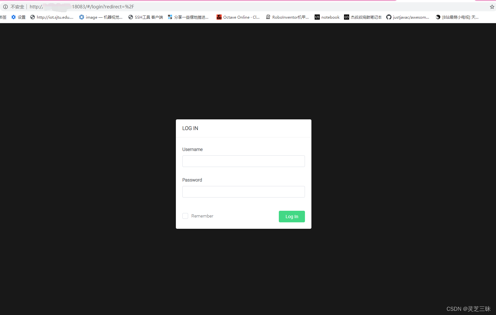
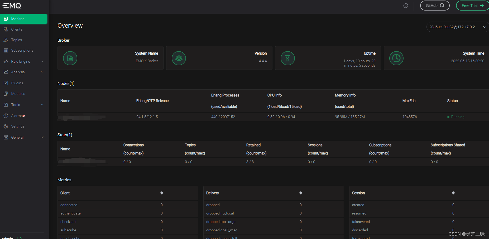

[TOC]

## 本页将指导您使用官方 Docker 镜像快速安装和运行 EMQX，并使用 Docker Compose 实现集群搭建。

### 通过 Docker 运行单个 EMQX 节点
本节主要介绍如何通过 Docker 镜像安装最新版本的 EMQX，如希望体验其他版本，可以前往 EMQX 下载页面。

运行以下命令获取 Docker 镜像：
```
docker pull emqx/emqx:5.6.0
```
运行以下命令启动 Docker 容器。
```
sudo docker run -d --name emqx -p 1883:1883 -p 8383:8083 -p 8384:8084 -p 8883:8883 -p 18083:18083 emqx/emqx:5.6.0
```
```
- 1883:1883 #MQTT TCP
- 8883:8883 #MQTT TCP SSL
- 8383:8083 #MQTT Web Socket
- 8384:8084 #MQTT Web Socket SSL
- 18083:18083 #EMQX Dashboard
```

有关 EMQX 官方镜像的更多信息，请查看 Docker Hub - emqx。

Docker 部署注意事项
如果需要持久 Docker 容器 ，请将以下目录挂载到容器外部，这样即使容器被删除数据也不会丢失：

```
/opt/emqx/data
/opt/emqx/log
```
关于 EMQX 目录结构的详细信息请参考 EMQX 文件和目录。

启动容器并挂载目录：

```
docker run -d --name emqx \
  -p 1883:1883 -p 8083:8083 \
  -p 8084:8084 -p 8883:8883 \
  -p 18083:18083 \
  -v $PWD/data:/opt/emqx/data \
  -v $PWD/log:/opt/emqx/log \
  emqx/emqx:5.6.0
```
Docker 内的 localhost 或 127.0.0.1 指向的是容器内部地址，如需访问宿主机地址请使用宿主机的真实 IP 或使用 host 网络模式。如果您使用的是 Docker for Mac 或 Docker for Windows，可以使用 host.docker.internal 作为宿主机地址。

由于 EMQX 使用 data/mnesia/<节点名> 作为数据存储目录，请使用 hostname 或者 FQDN 等固定的信息作为节点名，避免因为节点名称变动导致数据丢失。

### 通过 Docker Compose 构建 EMQX 集群
Docker Compose 是一个用于编排和运行多容器的工具，下面将指导您通过 Docker Compose 创建简单的 EMQX 静态集群用于测试。

请注意，本章节中的 Docker Compose 示例文件仅适用于本地测试，如果您需要在生产环境中部署集群请参考 构建集群。

TIP
>目前 Docker Compose 已经包含在 Docker 安装包中无需单独安装，如果您的 Docker 中没有包含 Compose 请参考 Install Docker Compose 进行安装。

在任意目录创建 docker-compose.yml 文件，内容如下：
```
version: '3'

services:
  emqx1:
    image: emqx:5.6.0
    container_name: emqx1
    environment:
    - "EMQX_NODE_NAME=emqx@node1.emqx.io"
    - "EMQX_CLUSTER__DISCOVERY_STRATEGY=static"
    - "EMQX_CLUSTER__STATIC__SEEDS=[emqx@node1.emqx.io,emqx@node2.emqx.io]"
    healthcheck:
      test: ["CMD", "/opt/emqx/bin/emqx", "ctl", "status"]
      interval: 5s
      timeout: 25s
      retries: 5
    networks:
      emqx-bridge:
        aliases:
        - node1.emqx.io
    ports:
      - 1883:1883
      - 8083:8083
      - 8084:8084
      - 8883:8883
      - 18083:18083 
    # volumes:
    #   - $PWD/emqx1_data:/opt/emqx/data

  emqx2:
    image: emqx:5.6.0
    container_name: emqx2
    environment:
    - "EMQX_NODE_NAME=emqx@node2.emqx.io"
    - "EMQX_CLUSTER__DISCOVERY_STRATEGY=static"
    - "EMQX_CLUSTER__STATIC__SEEDS=[emqx@node1.emqx.io,emqx@node2.emqx.io]"
    healthcheck:
      test: ["CMD", "/opt/emqx/bin/emqx", "ctl", "status"]
      interval: 5s
      timeout: 25s
      retries: 5
    networks:
      emqx-bridge:
        aliases:
        - node2.emqx.io
    # volumes:
    #   - $PWD/emqx2_data:/opt/emqx/data

networks:
  emqx-bridge:
    driver: bridge

```
通过命令行切换 docker-compose.yml 文件所在目录，然后输入以下命令启动 EMQX 集群：
```
docker-compose up -d
```
查看集群状态
```
$ docker exec -it emqx1 sh -c "emqx ctl cluster status"
Cluster status: #{running_nodes => ['emqx@node1.emqx.com','emqx@node2.emqx.com'],
                  stopped_nodes => []}
```

### 登录EMQX web管理页面
ip处填写本机IP地址，可以ipconfig一下查看ip
在浏览器中输入以下链接

http://ip:18083  默认账号：admin 密码：public
出现如下界面就代表大功告成了！！



